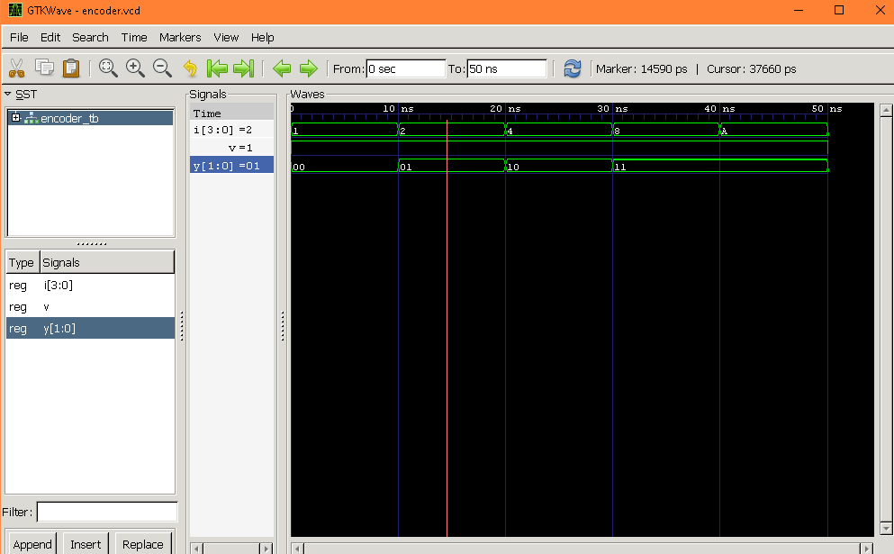
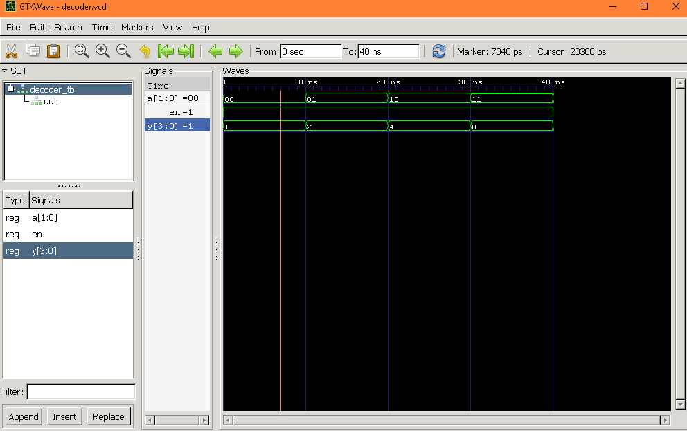

# Lab 3: VHDL Code for Combinational Circuits (Encoder and Decoder)

## OBJECTIVE
* To design and simulate a 4-to-2 priority encoder in VHDL.
* To design and simulate a 2-to-4 decoder in VHDL.

## THEORY
### Encoder
  An encoder converts 2n input lines into an n-bit binary code. Only one input is active (HIGH)
at a time. A 4-to-2 encoder has 4 inputs (I0–I3) and produces a 2-bit output (Y1Y0).
 
### Priority encoder 
A priority encoder handles the case where multiple inputs are high simultaneously by
giving priority to the highest-numbered active input. 

#### 📊 Truth Table (Priority Encoder 4-to-2)

| I3 | I2 | I1 | I0 | Y1 | Y0 |
| :---: | :---: | :---: | :---: | :---: | :---: |
| 0 | 0 | 0 | 1 | 0 | 0 |
| 0 | 0 | 1 | X | 0 | 1 |
| 0 | 1 | X | X | 1 | 0 |
| 1 | X | X | X | 1 | 1 |

### Decoder
A decoder converts an n-bit binary input into one of 2n output lines. A 2-to-4 decoder has
a 2-bit input (A1A0) and 4 output lines (Y0–Y3). Exactly one output is HIGH at a time.
 
 #### 📊 Truth Table (Decoder 2-to-4)

| A1 | A0 | Y3 | Y2 | Y1 | Y0 |
| :---: | :---: | :---: | :---: | :---: | :---: |
| 0 | 0 | 0 | 0 | 0 | 1 |
| 0 | 1 | 0 | 0 | 1 | 0 |
| 1 | 0 | 0 | 1 | 0 | 0 |
| 1 | 1 | 1 | 0 | 0 | 0 |

## OUTPUT 

### Encoder

### Decoder

## CONCLUSION
* Objective Met: Successfully designed and simulated a 4-to-2 priority encoder and a 2-to-4 decoder using VHDL.

* Encoder Logic: Verified that the priority encoder correctly prioritizes the highest-numbered active input line.

* Decoder Logic: Confirmed that the decoder accurately activates exactly one unique output line for each binary input.

* Simulation Success: All generated waveforms matched the theoretical truth tables with 100% accuracy.